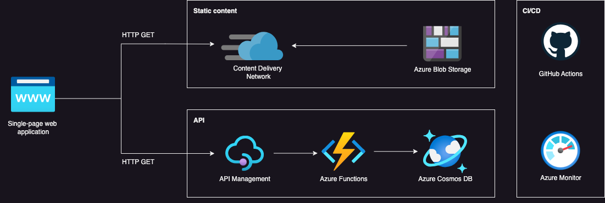

# azure-serverless-webapp
This is my website! It's a static website hosted on Azure Storage with a visitor counter powered by .NET and Azure Functions. Developed with HTML, CSS, and JavaScript; it features CI/CD workflows managed via GitHub Actions and integrates Azure services like Blob Storage and CosmosDB for a serverless web app with a dynamic database. 

## Demo
[View it live here](https://www.ellamaggs.com/)

## Structure
- 'frontend/': Folder contains HTML for website. 
    - 'main.js': Folder contains visitor counter JavaScript. 
- 'backend/': Folder defines Azure Function for storage in CosmosDB.
    - 'api/': Folder Contains the dontnet API deployed on Azure Functions.
    - 'Counter.cs': Contains the visitor counter code. 
- 'github/workflows/': Folder contains CI/CD workflow configurations. 

## Architecture

Azure CDN is leveraged to deliver content with low latency, enabling an HTTPS endpoint and providing support for custom domains to enhance security and branding. The static web assets, including HTML, CSS, and JavaScript files (stored in the frontend/ directory), are hosted in Azure Blob Storage and served to clients via static website hosting. This setup ensures high availability, fast content delivery through global caching, and scalability for handling increased user traffic.

Azure Functions is a serverless compute service that uses an event-driven model, triggered by client HTTP GET requests. Requests are routed through an API gateway managed by Azure API Management (APIM). APIM provides features like CORS to enable secure frontend-backend communication for displaying the visitor counter, along with tools like Application Insights for tracking API usage. The Function interacts with the CosmosDB input/output binding by fetching the visitor counter data, incrementing it by 1, and  returning the updated value to the caller. 

The CI/CD pipeline is automated through GitHub Actions, enabling a seamless integration and deployment process to continuously deliver updates to the website. This ensures development velocity, minimises downtime, and maintains the reliability and quality of the application with every push. Azure Monitor collects performance metrics about the services deployed in this solution and collects application logs. 

## Troubleshooting

## Roadmap